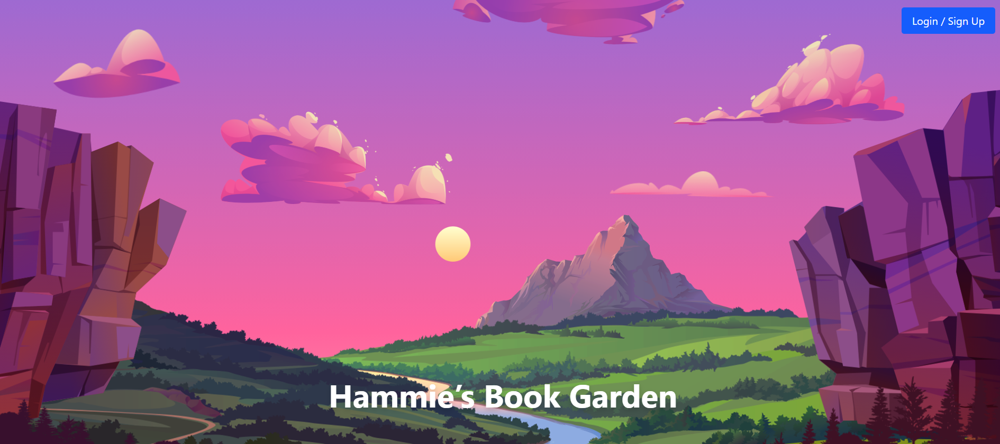
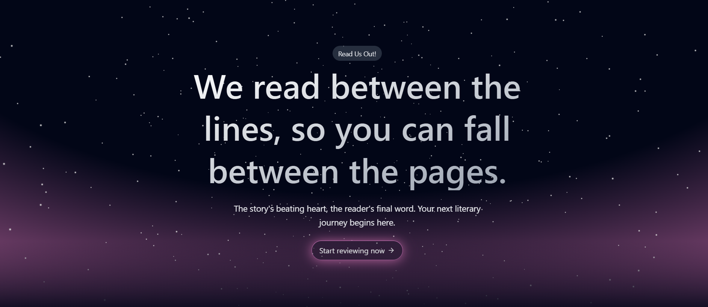
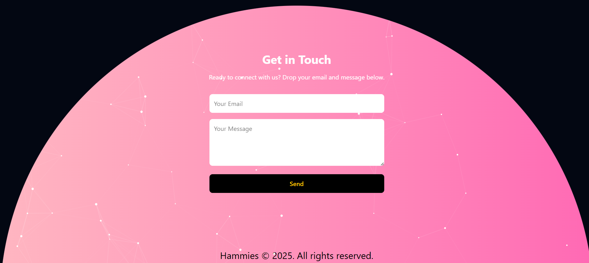

# 🌿📚 Hammies Book Garden  

> *"Among the stars and whispers of pages,  
> here grows a garden of stories,  
> where every book is a seed,  
> and every review a bloom."*  

Welcome to **Hammies Book Garden** — a digital sanctuary for readers.  
Here, you can wander through shelves of stories, read gentle summaries,  
share your thoughts through reviews, and discover what others felt before you.  
It’s not just a website — it’s a growing **cosmos of books and readers**. 

---


## ✨ Features  

- 📖 **Explore Books** – Browse through different titles with summaries.  
- 📝 **Review System** – Post and check reviews for every book.  
- 🔑 **Authentication** – Secure login & logout powered by **Supabase**.  
- 🎨 **Beautiful UI** – Crafted with **React + Vite + Tailwind CSS**.  
- 🌌 **Aurora & Stars** – A magical intro section with **Framer Motion** + **Three.js**.  
- 🎥 **Animations** – Smooth, interactive motion powered by **Framer Motion**.  
- 🪐 **Parallax Hero Section** – A cosmic landing that welcomes you.  
- 🌟 **Particle Footer** – Animated footer using **JS Particles**.

  
  
  
  
  
  

---

## 🖼️ Preview  

Here are glimpses of the garden:  

  
*The parallax entrance where stars guide your reading journey.*  

  
*An aurora of light, dancing softly above the words.*  

  
*A shelf where stories bloom and await discovery.*  

  
*Where readers leave their echoes for others to hear.*  

---

## ⚙️ Tech Stack  

- ⚛️ **React + Vite** – For a fast, modern frontend  
- 🎨 **Tailwind CSS** – Elegant, responsive styling  
- 🌀 **Framer Motion** – Fluid animations that breathe life  
- 🌌 **Three.js** – Stars and auroras painting the intro  
- 🔑 **Supabase** – Database & authentication backbone  
- ✨ **JS Particles** – Cosmic footer of glowing sparks  

---


## 🌱 Contribution  

This is an open garden — every new idea is like a seed 🌸.  
Feel free to fork, branch, and create pull requests.  
Whether you’re fixing a bug, adding a feature, or planting a poem —  
your contribution matters.  

---

## 📜 License  

This project is licensed under the MIT License.  
You are free to use, share, and grow your own garden from it.  

---

## 🌌 Closing Words  

> *"A book is a dream you hold in your hands.  
> In Hammies Book Garden, we hold dreams together."*  

🌿 Happy Reading & Contributing!  


## 🚀 Installation  

Clone the garden and let it bloom locally:  

```bash
# Clone this repository
git clone https://github.com/your-username/hammies-book-garden.git

# Enter the project directory
cd hammies-book-garden

# Install dependencies
npm install

# Start development server
npm run dev


🌿 Happy Reading & Contributing!
